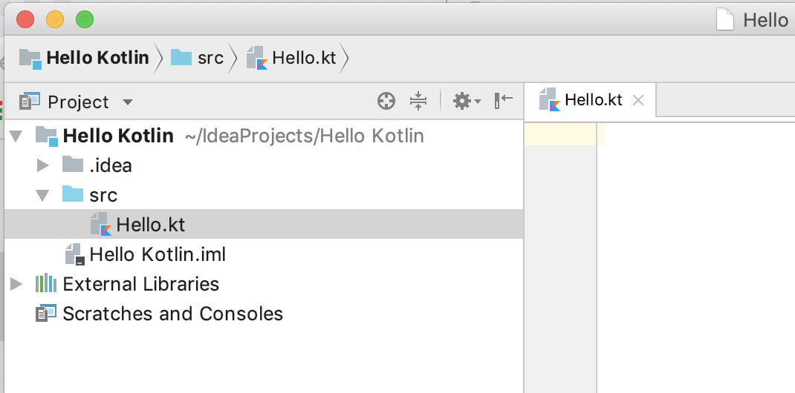
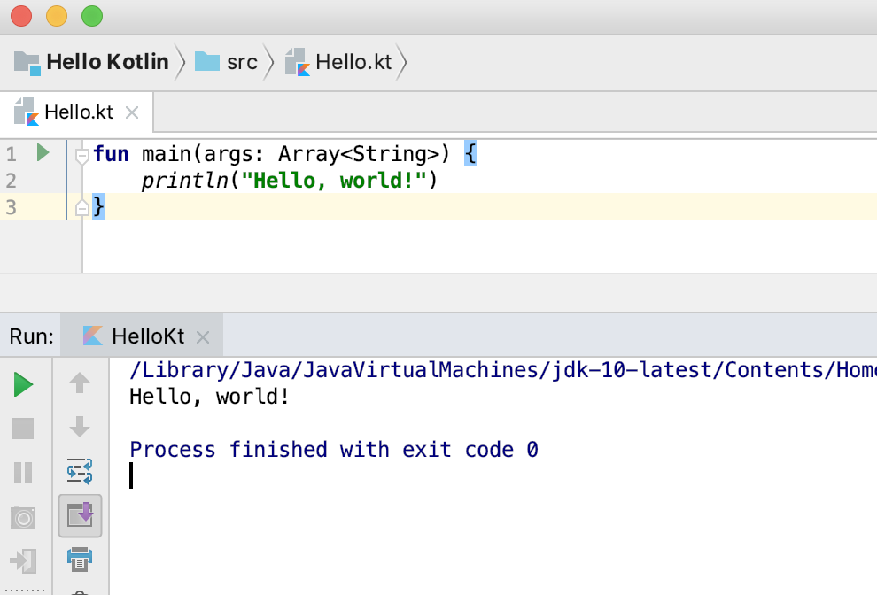
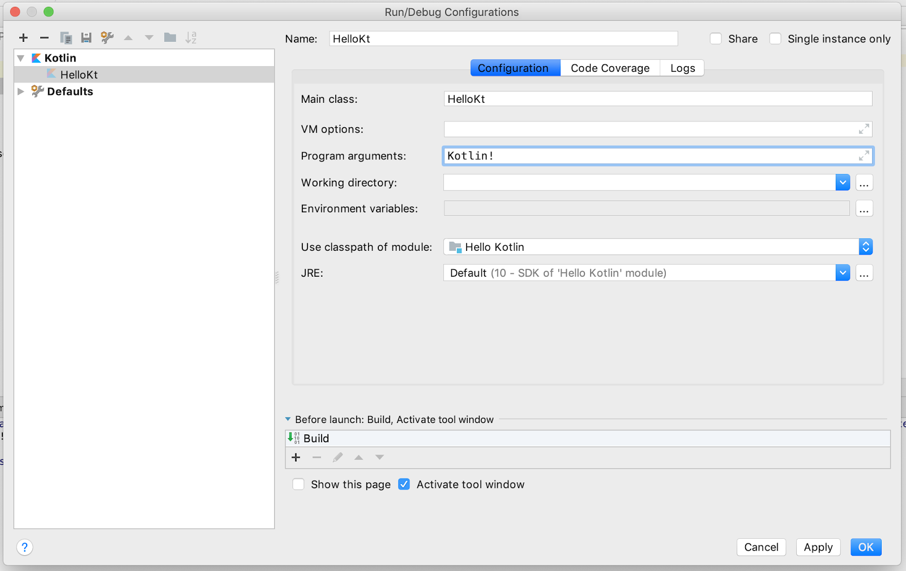

# Functions

### Explore the main() function

In this task, you create a Kotlin program and learn about the main() function, as well as how to pass arguments to a program from the command line.

You may remember the `printHello()` function that you entered into the REPL in a previous codelab:

```kotlin
fun printHello() {
    println ("Hello World")
}

printHello()
```

⇒ `Hello World`

You define functions using the `fun` keyword, followed by the name of the function. As with other programming languages, the parentheses `()` are for function arguments, if any. Curly braces `{}` frame the code for the function. There is no return type for this function, because it doesn't return anything.

##### Create a Kotlin File

1.  Open IntelliJ IDEA.
2.  The Project pane on the left in IntelliJ IDEA shows a list of your project files and folders. Find and right-click the src folder under Hello Kotlin. (You should already have the Hello Kotlin project from the previous codelab.)
3.  Select New > Kotlin File / Class.
4.  Keep Kind as File, and name the file Hello.
5.  Click OK.

There is now a file in the **src** folder called **Hello.kt**.



##### Add code and run your program

1.  As with other languages, the Kotlin `main()` function specifies the entry point for execution. Any command line arguments are passed as an array of strings.

```kotlin
fun main(args: Array) {
    println("Hello, world!")
}
```

> **Tip:** As of Kotlin 1.3, if your main() function doesn't use any parameters, you don't need to define args.

Like your earlier `printHello()` function, this function has no `return` statement. Every function in Kotlin returns something, even when nothing is explicitly specified. So a function like this `main()` function returns a type `kotlin.Unit`, which is Kotlin's way of saying no value.

> `Note:` When a function returns `kotlin.Unit`, you don't have to specify it explicitly. This is different from some other languages, where you have to explicitly say that you are returning nothing.

3.  To run your program, click the green triangle to the left of the `main()` function. Select `Run 'HelloKt'` from the menu.

4.  IntelliJ IDEA compiles the program and runs it. The results appear in a log pane at the bottom, as shown below.



> **Java programmers:** If you're using a previously installed version of IntelliJ IDEA instead of installing a fresh copy, at this point you may have problems accessing the Kotlin compiler. Be sure your project is referring to the correct version of the JDK. See this discussion on Stack Overflow and the Change project SDK documentation for IntelliJ IDEA.

##### Pass arguments to main()

Because you are running your program from IntelliJ IDEA and not from the command line, you need to specify any arguments to the program a little differently.

1.  Select Run > Edit Configurations. The Run/Debug Configurations window opens.
2.  Type Kotlin! in the Program arguments field.
3.  Click OK.



##### Change the code to use a string template

A [string template](https://kotlinlang.org/docs/reference/basic-types.html#string-templates) inserts a variable or expression into a string, and `$` specifies that part of the string will be a variable or expression. Curly braces `{}` frame the expression, if any.

1.  In **Hello.kt**, change the greeting message to use the first argument passed into the program, `args[0]`, instead of `"world"`.

2.  Run the program, and the output includes the argument you specified.
    > ⇒ `Hello, Kotlin!`

### Learn why (almost) everything has a value
In this task, you learn why almost everything in Kotlin has a value, and why that's useful.

Some other languages have statements, which are lines of code that don't have a value. In Kotlin, almost everything is an *expression* and has a value—even if that value is `kotlin.Unit`.

1. In **Hello.kt**, write code in `main()` to assign a `println()` to a variable called `isUnit` and print it. (`println()` does not return a value, so it returns `kotlin.Unit`.)
    ```kotlin
    // Will assign kotlin.Unit
    val isUnit = println("This is an expression")
    println(isUnit)
    ```
2. Run your program. The first `println()` prints the string "This is an expression". The second println() prints the value of the first println() statement, that is, kotlin.Unit.
    ```
    ⇒ `This is an expression`
    `kotlin.Unit`
    ```
3. Declare a `val` called `temperature` and initialize it to 10.
4. Declare another `val` called `isHot` and assign the return value of an `if`/`else` statement to `isHot`, as shown in the following code. Because it is an expression, you can use the value of the `if` expression right away.
    ````kotlin
    val temperature = 10
    val isHot = if (temperature > 50) true else false
    println(isHot)
    ````
    > ⇒ `false`

5. Use the value of an expression in a string template. Add some code to check the temperature to determine whether a fish is safe or too warm, then run your program.
    ```kotlin
    val temperature = 10
    val message = "The water temperature is ${ if (temperature > 50) "too warm" else "OK" }."
    println(message)
    ```
    > ⇒ `The water temperature is OK.`

> **Note:** Loops are exceptions to "everything has a value." There's no sensible value for for loops or while loops, so they do not have values. If you try to assign a loop's value to something, the compiler gives an error.

### Learn more about functions
In this task, you learn more about functions in Kotlin, and more about the very useful `when` conditional expression.

##### Create some functions
In this step, you put together some of what you've learned and create functions with different types. You can replace the contents of `Hello.kt` with this new code.

1. Write a function called `feedTheFish()` that calls `randomDay()` to get a random day of the week. Use a string template to print a `food` for the fish to eat that day. For now, the fish eat the same food every day.
    ```kotlin
    fun feedTheFish() {
        val day = randomDay()
        val food = "pellets"
        println ("Today is $day and the fish eat $food")
    }

    fun main(args: Array<String>) {
        feedTheFish()
    }
    ```

2. Write the `randomDay()` function to pick a random day from an array and return it.

    The `nextInt()` function takes an integer limit, which limits the number from `Random()` to 0 through 6 to match the `week` array.
    ```kotlin
    fun randomDay() : String {
    val week = arrayOf ("Monday", "Tuesday", "Wednesday", "Thursday",
            "Friday", "Saturday", "Sunday")
    return week[Random().nextInt(week.size)]
    }
    ```

3. The `Random()` and `nextInt()` functions are defined in `java.util.*`. At the top of the file, add the needed import:
    ```java
    import java.util.*    // required import
    ```
> **Tip:** Before you add the import, `Random()` gives an unresolved reference error in IntelliJ IDEA. To add the import automatically, click on `Random()`, then press `Alt+Enter` (`Option+Enter` on a Mac). Select **Import > java.util.Random**.

4. Run your program, and check the output.
    > ⇒ `Today is Tuesday and the fish eat pellets`

##### Use a when expression
Extending this further, change the code to pick different food for different days using a `when` expression. The `when` statement is similar to `switch` in other programming languages, but when automatically breaks at the end of each branch. It also makes sure your code covers all the branches if you are checking an enum.

1. In **Hello.kt**, add a function called `fishFood()` that takes a day as a `String` and returns the fish's food for the day as a `String`. Use `when()`, so that each day the fish gets a specific food. Run your program a few times to see different outputs.
    ```kotlin
    fun fishFood (day : String) : String {
        var food = ""
        when (day) {
            "Monday" -> food = "flakes"
            "Tuesday" -> food = "pellets"
            "Wednesday" -> food = "redworms"
            "Thursday" -> food = "granules"
            "Friday" -> food = "mosquitoes"
            "Saturday" -> food = "lettuce"
            "Sunday" -> food = "plankton"
        }
        return food
    }

    fun feedTheFish() {
        val day = randomDay()
        val food = fishFood(day)

        println ("Today is $day and the fish eat $food")
    }
    ```
    > ⇒ Today is Thursday and the fish eat granules

2. Add a default branch to the `when` expression using `else`. For testing, to make sure the default is taken sometimes in your program, remove the `Tuesday` and `Saturday` branches.
    Having a default branch ensures that `food` gets a value before being returned, so it doesn't need to be initialized anymore. Because the code now assigns a string to `food` only once, you can declare food with `val` instead of `var`.
    ```kotlin
    fun fishFood (day : String) : String {
    val food : String
    when (day) {
        "Monday" -> food = "flakes"
        "Wednesday" -> food = "redworms"
        "Thursday" -> food = "granules"
        "Friday" -> food = "mosquitoes"
        "Sunday" -> food = "plankton"
        else -> food = "nothing"
    }
    return food
    }
    ```

3. Because every expression has a value, you can make this code a little more concise. Return the value of the when expression directly, and eliminate the food variable. The value of the when expression is the value of the last expression of the branch that satisfied the condition.
    ```kotlin
    fun fishFood (day : String) : String {
        return when (day) {
            "Monday" -> "flakes"
            "Wednesday" -> "redworms"
            "Thursday" -> "granules"
            "Friday" -> "mosquitoes"
            "Sunday" -> "plankton"
            else -> "nothing"
        }
    }
    ```

The final version of your program looks something like the code below.
```kotlin
fun fishFood (day : String) : String {
    return when (day) {
        "Monday" -> "flakes"
        "Wednesday" -> "redworms"
        "Thursday" -> "granules"
        "Friday" -> "mosquitoes"
        "Sunday" -> "plankton"
        else -> "nothing"
    }
}
The final version of your program looks something like the code below.

import java.util.*    // required import

fun randomDay() : String {
    val week = arrayOf ("Monday", "Tuesday", "Wednesday", "Thursday",
        "Friday", "Saturday", "Sunday")
    return week[Random().nextInt(week.size)]
}

fun fishFood (day : String) : String {
    return when (day) {
        "Monday" -> "flakes"
        "Wednesday" -> "redworms"
        "Thursday" -> "granules"
        "Friday" -> "mosquitoes"
        "Sunday" -> "plankton"
        else -> "nothing"
    }
}

fun feedTheFish() {
    val day = randomDay()
    val food = fishFood(day)
    println ("Today is $day and the fish eat $food")
}

fun main(args: Array<String>) {
    feedTheFish()
}
```

##### Explore default values and compact functions
In this task, you learn about default values for functions and methods. You also learn about compact functions, which can make your code more concise and readable, and can reduce the number of code paths for testing. Compact functions are also called single-expression functions.

##### Create a default value for a parameter
In Kotlin, you can pass arguments by parameter name. You can also specify default values for parameters: if an argument isn't supplied by the caller, the default value is used. Later, when you write methods (member functions), it means you can avoid writing lots of overload versions of the same method.

1. In **Hello.kt**, write a `swim()` function with a `String` parameter named speed that prints the fish's speed. The speed parameter has a default value of `"fast"`.
    ```kotlin
    fun swim(speed: String = "fast") {
    println("swimming $speed")
    }
    ```

2. From the `main()` function, call the `swim()` function three ways. First call the function using the default. Then call the function and pass the `speed` parameter without a name, then call the function by naming the `speed` parameter.
    ```kotlin
    swim()   // uses default speed
    swim("slow")   // positional argument
    swim(speed="turtle-like")   // named parameter
    ```
    > ⇒ `swimming fast`
         `swimming slow`
         `swimming turtle-like`

> **Note:** Arguments don't have to use the parameter names; you can just pass the arguments in the defined order. But with default values, this can get a little confusing, so it is best practice to put parameters without defaults first, and the ones with defaults after.

##### Add required parameters
1. If no default is specified for a parameter, the corresponding argument must always be passed.
In Hello.kt, write a shouldChangeWater() function that takes three parameters: day, temperature, and a dirty level. The function returns true if the water should be changed, which happens if it's Sunday, if the temperature is too high, or if the water is too dirty. The day of the week is required, but the default temperature is 22, and the default dirty level is 20.

Use a when expression without an argument, which in Kotlin acts as a series of if/else if checks.
```kotlin
fun shouldChangeWater (day: String, temperature: Int = 22, dirty: Int = 20): Boolean {
    return when {
        temperature > 30 -> true
        dirty > 30 -> true
        day == "Sunday" ->  true
        else -> false
    }
}
```
2. Call `shouldChangeWater()` from `feedTheFish()` and supply the day. The `day` parameter doesn't have a default, so you must specify an argument. The other two parameters of `shouldChangeWater()` have default values, so you don't have to pass arguments for them.
    ```kotlin
    fun feedTheFish() {
        val day = randomDay()
        val food = fishFood(day)
        println ("Today is $day and the fish eat $food")
        println("Change water: ${shouldChangeWater(day)}")
    }
    ```
    > => `Today is Thursday and the fish eat granules`
    `Change water: false`

##### Make compact functions
The `when` expression that you wrote in the previous step packs a lot of logic into a small amount of code. If you wanted to unpack it a little, or if the conditions to check were more complicated, you could use some well-named local variables. But the Kotlin way to do it is with compact functions.

Compact functions, or [single-expression functions](https://kotlinlang.org/docs/reference/idioms.html#single-expression-functions), are a common pattern in Kotlin. When a function returns the results of a single expression, you can specify the body of the function after an `=` symbol, omit the curly braces `{}`, and omit the `return`.

1. in Hello.kt, add compact functions to test the conditions.
    ```kotlin
    fun isTooHot(temperature: Int) = temperature > 30

    // fun isTooHot(temperature: Int): Boolean = temperature > 30

    fun isDirty(dirty: Int) = dirty > 30

    fun isSunday(day: String) = day == "Sunday"
    ```

2. Change shouldChangeWater() to call the new functions.
    ```kotlin
    fun shouldChangeWater (day: String, temperature: Int = 22, dirty: Int = 20): Boolean {
        return when {
            isTooHot(temperature) -> true
            isDirty(dirty) -> true
            isSunday(day) -> true
            else  -> false
        }
    }
    ```

3. Run your program. The output from the `println()` with `shouldChangeWater()` should be the same as it was before you switched to using compact functions.

##### Default values
The default value for a parameter doesn't have to be a value. It can be another function, as shown in the following partial sample:
```kotlin
fun shouldChangeWater (day: String, temperature: Int = 22, dirty: Int = getDirtySensorReading()): Boolean {
    ...
```
> **Note:** A function used as a default value is evaluated at runtime, so do not put an expensive operation like a file read or a large memory allocation in the function. The operation is executed every time your function is called, which may slow down your program.

### Get started with filters
In this task, you learn a bit about filters in Kotlin. Filters are a handy way to get part of a list based on some condition.

##### Create a filter
1. In **Hello.kt**, define a list of aquarium decorations at the top level with `listOf()`. You can replace the contents of **Hello.kt**.
    ```kotlin
    val decorations = listOf ("rock", "pagoda", "plastic plant", "alligator", "flowerpot")
    ```

2. Create a new `main()` function with a line to print only the decorations that start with the letter 'p'. The code for the filter condition is in curly braces `{}`, and `it` refers to each item as the filter loops through. If the expression returns `true`, the item is included.
    ```kotlin
    fun main() {
        println( decorations.filter {it[0] == 'p'})
    }
    ```

3. Run your program, and you see the following output in the **Run** window:
    > ⇒ `[pagoda, plastic plant] `

##### Compare eager and lazy filters
If you're familiar with filters in other languages, you may wonder whether filters in Kotlin are eager or lazy. Is the result list created immediately, or when the list is accessed? In Kotlin, it happens whichever way you need it to. By default, `filter` is eager, and each time you use the filter, a list is created.

To make the filter lazy, you can use a [Sequence](https://kotlinlang.org/api/latest/jvm/stdlib/kotlin.sequences/index.html), which is a collection that can only look at one item at a time, starting at the beginning, and going to the end. Conveniently, this is exactly the API that a lazy filter needs.

1. In **Hello.kt**, change your code to assign the filtered list to a variable called `eager`, then print it.
    ```kotlin
    fun main() {
        val decorations = listOf ("rock", "pagoda", "plastic plant", "alligator", "flowerpot")

        // eager, creates a new list
        val eager = decorations.filter { it [0] == 'p' }
        println("eager: $eager")
    ```

2. Below that code, evaluate the filter using a `Sequence` with `asSequence()`. Assign the sequence to a variable called `filtered`, and print it.
    ```kotlin
    // lazy, will wait until asked to evaluate
    val filtered = decorations.asSequence().filter { it[0] == 'p' }
    println("filtered: $filtered")
    ```

When you return the filter results as a `Sequence`, the `filtered` variable won't hold a new list—it'll hold a `Sequence` of the list elements and knowledge of the filter to apply to those elements. Whenever you access elements of the `Sequence`, the filter is applied, and the result is returned to you.

3. Force evaluation of the sequence by converting it to a `List` with `toList()`. Print the result.
    ```kotlin
    // force evaluation of the lazy list
    val newList = filtered.toList()
    println("new list: $newList")
    ```

4. Run your program and observe the output.
> ⇒ `eager: [pagoda, plastic plant]`
`filtered: kotlin.sequences.FilteringSequence@386cc1c4`
`new list: [pagoda, plastic plant]`

To visualize what's going on with the `Sequence` and lazy evaluation, use the `map()` function. The `map()` function performs a simple transformation on each element in the sequence.

5. With the same `decorations` list as above, make a transformation with `map()` that does nothing, and simply returns the element that was passed. Add a `println()` to show each time an element is accessed, and assign the sequence to a variable called `lazyMap`.
```kotlin
    val lazyMap = decorations.asSequence().map {
        println("access: $it")
        it
    }
```

6. Print `lazyMap`, print the first element of `lazyMap` using `first()`, and print `lazyMap` converted to a `List`.
    ```kotlin
        println("lazy: $lazyMap")
        println("-----")
        println("first: ${lazyMap.first()}")
        println("-----")
        println("all: ${lazyMap.toList()}")
    ```

7. Run your program, and observe the output. Printing `lazyMap` just prints a reference to the `Sequence`—the inner `println()` isn't called. Printing the first element accesses only the first element. Converting the `Sequence` to a `List` accesses all the elements.
> ⇒ `lazy: kotlin.sequences.TransformingSequence@5ba23b66`
`-----`
`access: rock`
`first: rock`
`-----`
`access: rock`
`access: pagoda`
`access: plastic plant`
`access: alligator`
`access: flowerpot`
`all: [rock, pagoda, plastic plant, alligator, flowerpot]`

8. Create a new `Sequence` using the original filter before applying `map`. Print that result.
    ```kotlin
        val lazyMap2 = decorations.asSequence().filter {it[0] == 'p'}.map {
            println("access: $it")
            it
        }
        println("-----")
        println("filtered: ${lazyMap2.toList()}")
    ```

9. Run your program and observe the additional output. As with getting the first element, the inner println() is only called for the elements that are accessed.
> ⇒
`-----`
`access: pagoda`
`access: plastic plant`
`filtered: [pagoda, plastic plant]`

### Get started with lambdas and higher-order functions
In this task, you get an introduction to [lambdas and higher-order functions](https://kotlinlang.org/docs/reference/lambdas.html) in Kotlin.

##### Lambdas
In addition to traditional named functions, Kotlin supports lambdas. A *lambda* is an expression that makes a function. But instead of declaring a named function, you declare a function that has no name. Part of what makes this useful is that the lambda expression can now be passed as data. In other languages, lambdas are called *anonymous* functions, *function literals*, or similar names.

##### Higher-order functions
You can create a higher-order function by passing a lambda to another function. In the previous task, you created a higher-order function called    . You passed the following lambda expression to `filter` as the condition to check:
`{it[0] == 'p'}`

Similarly, `map` is a higher-order function, and the lambda you passed to it was the transformation to apply.

##### Learn about lambdas
1. Like named functions, lambdas can have parameters. For lambdas, the parameters (and their types, if needed) go on the left of what is called a function arrow `->`. The code to execute goes to the right of the function arrow. Once the lambda is assigned to a variable, you can call it just like a function.
Using the REPL (**Tools > Kotlin > Kotlin REPL**), try out this code:
    ```kotlin
    var dirtyLevel = 20
    val waterFilter = { dirty : Int -> dirty / 2}
    println(waterFilter(dirtyLevel))
    ```
    > ⇒ `10`

In this example, the lambda takes an `Int` named `dirty`, and returns `dirty / 2`. (Because filtering removes dirt.)

2. Kotlin's syntax for function types is closely related to its syntax for lambdas. Use this syntax to cleanly declare a variable that holds a function:
    ```kotlin
    val waterFilter: (Int) -> Int = { dirty -> dirty / 2 }
    ```

Here's what the code says:
- Make a variable called `waterFilter`.
- `waterFilter` can be any function that takes an `Int` and returns an `Int`.
- Assign a lambda to `waterFilter`.
- The lambda returns the value of the argument `dirty` divided by 2.

Note that you don't have to specify the type of the lambda argument anymore. The type is calculated by type inference.

##### Create a higher-order function
So far, the examples for lambdas look mostly like functions. The real power of lambdas is using them to create higher-order functions, where the argument to one function is another function.

1. Write a higher-order function. Here's a basic example, a function that takes two arguments. The first argument is an integer. The second argument is a function that takes an integer and returns an integer. Try it out in the REPL.
```kotlin
fun updateDirty(dirty: Int, operation: (Int) -> Int): Int {
   return operation(dirty)
}
```
The body of the code calls the function that was passed as the second argument, and passes the first argument along to it.

2. To call this function, pass it an integer and a function.
```kotlin
val waterFilter: (Int) -> Int = { dirty -> dirty / 2 }
println(updateDirty(30, waterFilter))
```
> ⇒ `15`

The function you pass doesn't have to be a lambda; it can be a regular named function instead. To specify the argument as a regular function, use the `::` operator. This way Kotlin knows that you are passing the function reference as an argument, not trying to call the function.

3. Try passing a regular named function to updateDirty().
    ```kotlin
    fun increaseDirty( start: Int ) = start + 1

    println(updateDirty(15, ::increaseDirty))
    ```
    > ⇒ 16

> **Note:** Kotlin prefers that any parameter that takes a function is the last parameter. When working with higher-order functions, Kotlin has a special syntax, called the [last parameter call syntax](https://kotlinlang.org/docs/reference/lambdas.html#passing-a-lambda-to-the-last-parameter), which lets you make the code even more concise. In this case, you can pass a lambda for the function parameter, but you don't need to put the lambda inside the parentheses.

```kotlin
var dirtyLevel = 19;
dirtyLevel = updateDirty(dirtyLevel) { dirtyLevel -> dirtyLevel + 23}
println(dirtyLevel)
```
> ⇒ `42`

### Summary
- To create a Kotlin source file in IntelliJ IDEA, start with a Kotlin project.
- To compile and run a program in IntelliJ IDEA, click the green triangle next to the main() function. Output appears in a log window below.
- In IntelliJ IDEA, specify command line arguments to pass to the main() function in **Run > Edit Configurations**.
- Almost everything in Kotlin has a value. You can use this fact to make your code more concise by using the value of an `if` or `when` as an expression or return value.
- Default arguments remove the need for multiple versions of a function or method. For example:
`fun swim(speed: String = "fast") { ... }`
- Compact functions, or single-expression functions, can make your code more readable. For example:
`fun isTooHot(temperature: Int) = temperature > 3`0
- You've learned some basics about filters, which use lambda expressions. For example:
`val beginsWithP = decorations.filter { it [0] == 'p' }`
- A lambda expression is an expression that makes an unnamed function. Lambda expressions are defined between curly braces `{}`.
- In a higher-order function, you pass a function such as a lambda expression to another function as data. For example:
`dirtyLevel = updateDirty(dirtyLevel) { dirtyLevel -> dirtyLevel + 23}`
There's a lot in this lesson, especially if you're new to lambdas. A later lesson revisits lambdas and higher-order functions.

> **Note:** You may have noticed that in Kotlin, as in some other languages, there is more than one correct way to do things. Making code more compact sometimes helps readability and even performance, and sometimes it doesn't. As you learn more about Kotlin, you may find easier, more concise ways to do things.

