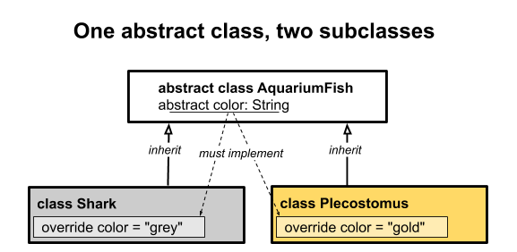
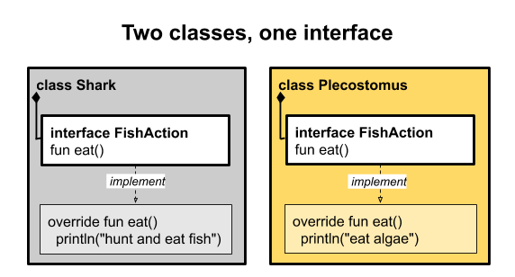
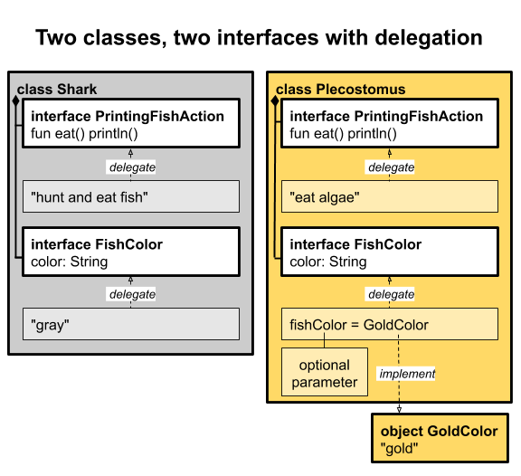

# Object-oriented programming

### Terminology

The following programming terms should already be familiar to you:
- Classes are blueprints for objects. For example, an `Aquarium` class is the blueprint for making an aquarium object.
- Objects are instances of classes; an aquarium object is one actual `Aquarium`.
- Properties are characteristics of classes, such as the length, width, and height of an `Aquarium`.
- Methods, also called member functions, are the functionality of the class. Methods are what you can "do" with the object. For example, you can `fillWithWater()` an `Aquarium` object.
- An interface is a specification that a class can implement. For example, cleaning is common to objects other than aquariums, and cleaning generally happens in similar ways for different objects. So you could have an interface called `Clean` that defines a `clean()` method. The `Aquarium` class could implement the Clean interface to clean the aquarium with a soft sponge.
- Packages are a way to group related code to keep it organized, or to make a library of code. Once a package is created, you can import the package's contents into another file and reuse the code and classes in it.

### Create a class
In this task, you create a new package and a class with some properties and a method.

##### Create a package
Packages can help you keep your code organized.
1. In the **Project** pane, under the **Hello Kotlin** project, right-click on the src folder.
2. Select **New > Package** and call it `example.myapp`.

##### Create a class with properties
Classes are defined with the keyword `class`, and class names by convention start with a capital letter.

1. Right-click on the **example.myapp** package.
2. Select **New > Kotlin File / Class**.
3. Under Kind, select Class, and name the class **`Aquarium`**. IntelliJ IDEA includes the package name in the file and creates an empty `Aquarium` class for you.
4. Inside the `Aquarium` class, define and initialize var properties for the width, height, and length (in centimeters). Initialize the properties with default values.
```kotlin
package example.myapp

class Aquarium {
    var width: Int = 20
    var height: Int = 40
    var length: Int = 100
}
```
Under the hood, Kotlin automatically creates getters and setters for the properties you defined in the `Aquarium` class, so you can access the properties directly, for example, `myAquarium.length`.

> **Note:** If you declared these properties with `val` instead of `var`, the properties would be immutable. You could only set them once, and all the instances of `Aquarium` would have the same dimensions.
Also note that IntelliJ IDEA underlines the name of each `var` in your code, but not each `val`. Kotlin coding style [prefers immutable data](https://kotlinlang.org/docs/reference/coding-conventions.html#immutability) when possible, so IntelliJ IDEA draws your attention to mutable data so you can minimize its use.

##### Create a main() function
Create a new file called `main.kt` to hold the `main()` function.
1. In the `Project` pane on the left, right-click on the **example.myapp** package.
2. Select **New > Kotlin File / Class**.
3. Under the Kind dropdown, keep the selection as File, and name the file `main.kt`. IntelliJ IDEA includes the package name, but doesn't include a class definition for a file.
4. Define a `buildAquarium()` function and inside create an instance of `Aquarium`. To create an instance, reference the class as if it were a function, `Aquarium()`. This calls the constructor of the class and creates an instance of the `Aquarium` class, similar to using `new` in other languages.
5. Define a `main()` function and call `buildAquarium()`.

```kotlin
package example.myapp

fun buildAquarium() {
    val myAquarium = Aquarium()
}

fun main() {
    buildAquarium()
}
```

##### Add a method
1.  In the `Aquarium` class, add a method to print the aquarium's dimension properties.
```kotlin
fun printSize() {
    println("Width: $width cm " +
            "Length: $length cm " +
            "Height: $height cm ")
}
```

2. In `main.kt`, in `buildAquarium()`, call the `printSize()` method on `myAquarium`.
```kotlin
fun buildAquarium() {
    val myAquarium = Aquarium()
    myAquarium.printSize()
}
```

3. Run your program by clicking the green triangle next to the `main()` function. Observe the result.
> ⇒ `Width: 20 cm Length: 100 cm Height: 40 cm` 

4. In `buildAquarium()`, add code to set the height to 60 and print the changed dimension properties.
```kotlin
fun buildAquarium() {
    val myAquarium = Aquarium()
    myAquarium.printSize()
    myAquarium.height = 60
    myAquarium.printSize()
}
```

5. Run your program and observe the output.
> ⇒ `Width: 20 cm Length: 100 cm Height: 40 cm` 
`Width: 20 cm Length: 100 cm Height: 60 cm `

### Add class constructors
In this task, you create a constructor for the class, and continue working with properties.

##### Create a constructor
In this step, you add a constructor to the `Aquarium` class you created in the first task. In the earlier example, every instance of `Aquarium` is created with the same dimensions. You can change the dimensions once it is created by setting the properties, but it would be simpler to create it the correct size to begin with.

In some programming languages, the constructor is defined by creating a method within the class that has the same name as the class. In Kotlin, you define the constructor directly in the class declaration itself, specifying the parameters inside parentheses as if the class was a method. As with functions in Kotlin, those parameters can include default values.

1. In the `Aquarium` class you created earlier, change the class definition to include three constructor parameters with default values for `length`, `width` and `height`, and assign them to the corresponding properties.
```kotlin
class Aquarium(length: Int = 100, width: Int = 20, height: Int = 40) {
   // Dimensions in cm
   var length: Int = length
   var width: Int = width
   var height: Int = height
...
}
```

2. The more compact Kotlin way is to define the properties directly with the constructor, using `var` or `val`, and Kotlin also creates the getters and setters automatically. Then you can remove the property definitions in the body of the class.
```kotlin
class Aquarium(var length: Int = 100, var width: Int = 20, var height: Int = 40) {
...
}
```

3. When you create an `Aquarium` object with that constructor, you can specify no arguments and get the default values, or specify just some of them, or specify all of them and create a completely custom-sized `Aquarium`. In the `buildAquarium()` function, try out different ways of creating an `Aquarium` object using named parameters.
```kotlin
fun buildAquarium() {
    val aquarium1 = Aquarium()
    aquarium1.printSize()
    // default height and length
    val aquarium2 = Aquarium(width = 25)
    aquarium2.printSize()
    // default width
    val aquarium3 = Aquarium(height = 35, length = 110)
    aquarium3.printSize()
    // everything custom
    val aquarium4 = Aquarium(width = 25, height = 35, length = 110)
    aquarium4.printSize()
}
```

4. Run the program and observe the output.
> ⇒ ``Width: 20 cm Length: 100 cm Height: 40 cm`` 
`Width: 25 cm Length: 100 cm Height: 40 cm` 
`Width: 20 cm Length: 110 cm Height: 35 cm` 
`Width: 25 cm Length: 110 cm Height: 35 cm` 

Notice that you didn't have to overload the constructor and write a different version for each of these cases (plus a few more for the other combinations). Kotlin creates what is needed from the default values and named parameters.

##### Add init blocks
The example constructors above just declare properties and assign the value of an expression to them. If your constructor needs more initialization code, it can be placed in one or more `init` blocks. In this step, you add some `init` blocks to `Aquarium` class.

1. In the `Aquarium` class, add an `init` block to print that the object is initializing, and a second block to print the volume in liters.

2. Run the program and observe the output.
```
aquarium initializing
Volume: 80 l
Width: 20 cm Length: 100 cm Height: 40 cm 
aquarium initializing
Volume: 100 l
Width: 25 cm Length: 100 cm Height: 40 cm 
aquarium initializing
Volume: 77 l
Width: 20 cm Length: 110 cm Height: 35 cm 
aquarium initializing
Volume: 96 l
Width: 25 cm Length: 110 cm Height: 35 cm 
```

Notice that the ``init`` blocks are executed in the order in which they appear in the class definition, and all of them are executed when the constructor is called.

> **Note:** Parameters of the primary constructor can be used in the initializer blocks. Any properties used in initializer blocks must be declared previously.

##### Learn about secondary constructors
In this step, you learn about secondary constructors and add one to your class. In addition to a primary constructor, which can have one or more `init` blocks, a Kotlin class can also have one or more secondary constructors to allow constructor overloading, that is, constructors with different arguments.

> **Note:** Kotlin coding style says each class should have only one constructor, using default values and named parameters. This is because using multiple constructors leads to more code paths, and the likelihood that one or more paths will go untested. Before writing a secondary constructor, consider whether a [factory function](https://kotlinlang.org/docs/reference/coding-conventions.html#factory-functions) would work instead, to keep the class definition clean.

> **Note:** Every secondary constructor must call the primary constructor first, either directly using `this()`, or indirectly by calling another secondary constructor. This means that any `init` blocks in the primary will be called for all constructors, and all the code in the primary constructor will be executed first.

1. In the `Aquarium` class, add a secondary constructor that takes a number of fish as its argument, using the `constructor` keyword. Create a `val` tank property for the calculated volume of the aquarium in liters based on the number of fish. Assume 2 liters (2,000 cm^3) of water per fish, plus a little extra room so the water doesn't spill.
```kotlin
constructor(numberOfFish: Int) : this() {
    // 2,000 cm^3 per fish + extra room so water doesn't spill
    val tank = numberOfFish * 2000 * 1.1
}
```

2. Inside the secondary constructor, keep the length and width (which were set in the primary constructor) the same, and calculate the height needed to make the tank the given volume.
```kotlin
// calculate the height needed
height = (tank / (length * width)).toInt()
```

3. In the `buildAquarium()` function, add a call to create an `Aquarium` using your new secondary constructor. Print the size and volume.
```kotlin
fun buildAquarium() {
    val aquarium6 = Aquarium(numberOfFish = 29)
    aquarium6.printSize()
    println("Volume: ${aquarium6.width * aquarium6.length * aquarium6.height / 1000} l")
}
```

4. Run your program and observe the output.
```
⇒ aquarium initializing
Volume: 80 l
Width: 20 cm Length: 100 cm Height: 31 cm 
Volume: 62 l
```

Notice that the volume is printed twice, once by the `init` block in the primary constructor before the secondary constructor is executed, and once by the code in `buildAquarium()`.

You could have included the `constructor` keyword in the primary constructor, too, but it's not necessary in most cases.

##### Add a new property getter
In this step, you add an explicit property getter. Kotlin automatically defines getters and setters when you define properties, but sometimes the value for a property needs to be adjusted or calculated. For example, above, you printed the volume of the `Aquarium`. You can make the volume available as a property by defining a variable and a getter for it. Because `volume` needs to be calculated, the getter needs to return the calculated value, which you can do with a one-line function.
1. In the `Aquarium` class, define an `Int` property called `volume`, and define a `get()` method that calculates the volume in the next line.
2. Remove the `init` block that prints the volume.
3. Remove the code in `buildAquarium()` that prints the volume.
4. In the `printSize()` method, add a line to print the volume.
```kotlin
fun printSize() {
    println("Width: $width cm " +
            "Length: $length cm " +
            "Height: $height cm "
    )
    // 1 l = 1000 cm^3
    println("Volume: $volume l")
}
```
5. Run your program and observe the output.
```
⇒ `aquarium initializing`
`Width: 20 cm Length: 100 cm Height: 31 cm `
`Volume: 62 l`
```

The dimensions and volume are the same as before, but the volume is only printed once after the object is fully initialized by both the primary constructor and the secondary constructor.

##### Add a property setter
In this step, you create a new property setter for the volume.
1. In the `Aquarium` class, change `volume` to a `var` so it can be set more than once.
2. Add a setter for the `volume` property by adding a `set()` method below the getter, which recalculates the height based on the supplied amount of water. By convention, the name of the setter parameter is `value`, but you can change it if you prefer.
```kotlin
var volume: Int
    get() = width * height * length / 1000
    set(value) {
        height = (value * 1000) / (width * length)
    }
```
3. In `buildAquarium()`, add code to set the volume of the Aquarium to 70 liters. Print the new size.
```kotlin
fun buildAquarium() {
    val aquarium6 = Aquarium(numberOfFish = 29)
    aquarium6.printSize()
    aquarium6.volume = 70
    aquarium6.printSize()
}
```
4. Run your program again and observe the changed height and volume.
```
⇒ `aquarium initialized`
`Width: 20 cm Length: 100 cm Height: 31 cm `
`Volume: 62 l`
`Width: 20 cm Length: 100 cm Height: 35 cm `
`Volume: 70 l`
```

### Learn about visibility modifiers
There have been no visibility modifiers, such as public or private, in the code so far. That's because by default, everything in Kotlin is public, which means that everything can be accessed everywhere, including classes, methods, properties, and member variables.
In Kotlin, classes, objects, interfaces, constructors, functions, properties, and their setters can have *visibility modifiers*:

* `public` means visible outside the class. **Everything is public by default**, including variables and methods of the class.
* `internal` means it will only be visible within that module. A [module](https://kotlinlang.org/docs/reference/visibility-modifiers.html#modules) is a set of Kotlin files compiled together, for example, a library or application.
* `private` means it will only be visible in that class (or source file if you are working with functions).
* `protected` is the same as `private`, but it will also be visible to any subclasses.
See [Visibility Modifiers](https://kotlinlang.org/docs/reference/visibility-modifiers.html) in the Kotlin documentation for more information

##### Member variables
Properties within a class, or member variables, are `public` by default. If you define them with `var`, they are mutable, that is, readable and writable. If you define them with `val`, they are read-only after initialization.

If you want a property that your code can read or write, but outside code can only read, you can leave the property and its getter as public and declare the setter private, as shown below.
```kotlin
var volume: Int
    get() = width * height * length / 1000
    private set(value) {
        height = (value * 1000) / (width * length)
    }
```

### Learn about subclasses and inheritance
In this task, you learn how subclasses and inheritance work in Kotlin. They are similar to what you've seen in other languages, but there are some differences.

**In Kotlin, by default, classes cannot be subclassed. Similarly, properties and member variables cannot be overridden by subclasses (though they can be accessed).**

You must mark a class as `open` to allow it to be subclassed. Similarly, you must mark properties and member variables as `open`, in order to override them in the subclass. The `open` keyword is required, to prevent accidentally leaking implementation details as part of the class's interface.

##### Make the Aquarium class open
In this step, you make the `Aquarium` class `open`, so that you can override it in the next step.

1. Mark the `Aquarium` class and all its properties with the `open` keyword.
```kotlin
open class Aquarium (open var length: Int = 100, open var width: Int = 20, open var height: Int = 40) {
    open var volume: Int
        get() = width * height * length / 1000
        set(value) {
            height = (value * 1000) / (width * length)
        }
```

2. Add an `open` shape property with the value `"rectangle"`.
```kotlin
open val shape = "rectangle"
```

3. Add an open `water` property with a getter that returns 90% of the volume of the `Aquarium`.
```kotlin
open var water: Double = 0.0
    get() = volume * 0.9
```

4. Add code to the `printSize()` method to print the shape, and the amount of water as a percentage of the volume.
```kotlin
fun printSize() {
    println(shape)
    println("Width: $width cm " +
            "Length: $length cm " +
            "Height: $height cm ")
    // 1 l = 1000 cm^3
    println("Volume: $volume l Water: $water l (${water/volume*100.0}% full)")
}
```

5. In `buildAquarium()`, change the code to create an `Aquarium` with `width = 25`, `length = 25`, and `height = 40`.
```kotlin
fun buildAquarium() {
    val aquarium6 = Aquarium(length = 25, width = 25, height = 40)
    aquarium6.printSize()
}
```

6. Run your program and observe the new output.
```
⇒ aquarium initializing
rectangle
Width: 25 cm Length: 25 cm Height: 40 cm 
Volume: 25 l Water: 22.5 l (90.0% full)
```

##### Create a subclass
1. Create a subclass of `Aquarium` called `TowerTank`, which implements a rounded cylinder tank instead of a rectangular tank. You can add `TowerTank` below `Aquarium`, because you can add another class in the same file as the `Aquarium` class.

2. In `TowerTank`, override the `height` property, which is defined in the constructor. To override a property, use the `override` keyword in the subclass.

> **Note:** Subclasses must declare their constructor parameters explicitly.

3. Make the constructor for `TowerTank` take a `diameter`. Use the `diameter` for both `length` and `width` when calling the constructor in the Aquarium superclass.

4. Override the volume property to calculate a cylinder. The formula for a cylinder is pi times the radius squared times the height. You need to import the constant `PI` from `java.lang.Math`.
```kotlin
override var volume: Int
// ellipse area = π * r1 * r2
get() = (width/2 * length/2 * height / 1000 * PI).toInt()
set(value) {
    height = ((value * 1000 / PI) / (width/2 * length/2)).toInt()
}
```

5. In `TowerTank`, override the `water` property to be 80% of the volume.
```kotlin
override var water = volume * 0.8
```

6. Override the shape to be "cylinder".
```kotlin
override val shape = "cylinder"
```

7. Your final TowerTank class should look something like the code below.

`Aquariam.kt`:
```kotlin
package example.myapp

import java.lang.Math.PI

... // existing Aquarium class

class TowerTank (override var height: Int, var diameter: Int): Aquarium(height = height, width = diameter, length = diameter) {
    override var volume: Int
    // ellipse area = π * r1 * r2
    get() = (width/2 * length/2 * height / 1000 * PI).toInt()
    set(value) {
        height = ((value * 1000 / PI) / (width/2 * length/2)).toInt()
    }

    override var water = volume * 0.8
    override val shape = "cylinder"
}
```

8. In `buildAquarium()`, create a `TowerTank` with a diameter of 25 cm and a height of 45 cm. Print the size.
`main.kt`:
```kotlin
package example.myapp

fun buildAquarium() {
    val myAquarium = Aquarium(width = 25, length = 25, height = 40)
    myAquarium.printSize()
    val myTower = TowerTank(diameter = 25, height = 40)
    myTower.printSize()
}
```

9. Run your program and observe the output.
```
⇒ aquarium initializing
rectangle
Width: 25 cm Length: 25 cm Height: 40 cm 
Volume: 25 l Water: 22.5 l (90.0% full)
aquarium initializing
cylinder
Width: 25 cm Length: 25 cm Height: 40 cm 
Volume: 18 l Water: 14.4 l (80.0% full)
```

### Compare abstract classes and interfaces
Sometimes you want to define common behavior or properties to be shared among some related classes. Kotlin offers two ways to do that, interfaces and abstract classes. In this task, you create an abstract `AquariumFi`sh class for properties that are common to all fish. You create an interface called `FishAction` to define behavior common to all fish.
- Neither an abstract class nor an interface can be instantiated on its own, which means you cannot create objects of those types directly.
- Abstract classes have constructors.
- Interfaces can't have any constructor logic or store any state.

> **Note:** Abstract classes are always open; you don't need to mark them with `open`. *Properties and methods of an abstract class are non-abstract unless you explicitly mark them with the `abstract` keyword*. That means subclasses can use them as given. If properties or methods are abstract, the subclasses must implement them.

##### Create an abstract class
1. Under **example.myapp**, create a new file, `AquariumFish.kt`.
2. Create a class, also called `AquariumFish`, and mark it with abstract.
3. Add one `String` property, `color`, and mark it with `abstract`
    ```kotlin
    package example.myapp

    abstract class AquariumFish {
        abstract val color: String
    }
    ```
4. Create two subclasses of `AquariumFish`, `Shark` and `Plecostomus`.
5. Because color is `abstract`, the subclasses must implement it. Make `Shark` gray and `Plecostomus` gold.
    ```kotlin
    class Shark: AquariumFish() {
        override val color = "gray"
    }

    class Plecostomus: AquariumFish() {
        override val color = "gold"
    }
    ```
6. In **main.kt**, create a `makeFish()` function to test your classes. Instantiate a `Shark` and a `Plecostomus`, then print the color of each.
7. Delete your earlier test code in `main()` and add a call to `makeFish()`. Your code should look something like the code below.

`main.kt`:
```kotlin
package example.myapp

fun makeFish() {
    val shark = Shark()
    val pleco = Plecostomus()

    println("Shark: ${shark.color}")
    println("Plecostomus: ${pleco.color}")
}

fun main () {
    makeFish()
}
```

8. Run your program and observe the output.
```
⇒ Shark: gray 
Plecostomus: gold
```

The following diagram represents the `Shark` class and `Plecostomus` class, which subclass the abstract class, `AquariumFish`.


##### Create an interface
1. In **AquariumFish.kt**, create an interface called `FishAction` with a method `eat()`.
```kotlin
interface FishAction  {
    fun eat()
}
```

2. Add `FishAction` to each of the subclasses, and implement `eat()` by having it print what the fish does.
```kotlin
class Shark: AquariumFish(), FishAction {
    override val color = "gray"
    override fun eat() {
        println("hunt and eat fish")
    }
}

class Plecostomus: AquariumFish(), FishAction {
    override val color = "gold"
    override fun eat() {
        println("eat algae")
    }
}
```

3. In the `makeFish()` function, have each fish you created eat something by calling `eat()`.
```kotlin
fun makeFish() {
    val shark = Shark()
    val pleco = Plecostomus()
    println("Shark: ${shark.color}")
    shark.eat()
    println("Plecostomus: ${pleco.color}")
    pleco.eat()
}
```

4. Run your program and observe the output.
```
⇒ Shark: gray
hunt and eat fish
Plecostomus: gold
eat algae
```

The following diagram represents the `Shark` class and the `Plecostomus` class, both of which are composed of and implement the `FishAction` interface.


##### When to use abstract classes versus interfaces
The examples above are simple, but when you have a lot of interrelated classes, abstract classes and interfaces can help you keep your design cleaner, more organized, and easier to maintain.

As noted above, abstract classes can have constructors, and interfaces cannot, but otherwise they are very similar. So, when should you use each?

When you use interfaces to compose a class, the class's functionality is extended by way of the class instances that it contains. Composition tends to make code easier to reuse and reason about than inheritance from an abstract class. Also, you can use multiple interfaces in a class, but you can only subclass from one abstract class.

> **Note:** When designing programs in Kotlin, consider how you can effectively use composition to build up an application from small composable building blocks.

Composition often leads to better encapsulation, lower coupling (interdependence), cleaner interfaces, and more usable code. For these reasons, using composition with interfaces is the preferred design. On the other hand, inheritance from an abstract class tends to be a natural fit for some problems. So you should prefer composition, but when inheritance makes sense Kotlin lets you do that too!

- Use an interface if you have a lot of methods and one or two default implementations, for example as in `AquariumAction` below.
```kotlin
interface AquariumAction {
    fun eat()
    fun jump()
    fun clean()
    fun catchFish()
    fun swim()  {
        println("swim")
    }
}
```

- Use an abstract class any time you can't complete a class. For example, going back to the `AquariumFish` class, you can make all `AquariumFish` implement `FishAction`, and provide a default implementation for `eat` while leaving `color` abstract, because there isn't really a default color for fish.
```kotlin
interface FishAction  {
    fun eat()
}

abstract class AquariumFish: FishAction {
   abstract val color: String
   override fun eat() = println("yum")
}
```

### Use interface delegation
The previous task introduced abstract classes, interfaces, and the idea of composition. `Interface delegation` is an advanced technique where the methods of an interface are implemented by a helper (or delegate) object, which is then used by a class. This technique can be useful when you use an interface in a series of unrelated classes: you add the needed interface functionality to a separate helper class, and each of the classes uses an instance of the helper class to implement the functionality.

In this task, you use interface delegation to add functionality to a class.

##### Make a new interface
1. In **AquariumFish.kt**, remove the `AquariumFish` class. Instead of inheriting from the `AquariumFish` class, `Plecostomus` and `Shark` are going to implement interfaces for both the fish action and their color.
2. Create a new interface, FishColor, that defines the color as a string.
```kotlin
interface FishColor {
    val color: String
}
```
3. Change `Plecostomus` to implement two interfaces, `FishAction`, and a `FishColor`. You need to override the `color` from `FishColor` and `eat()` from `FishAction`.
```kotlin
class Plecostomus: FishAction, FishColor {
    override val color = "gold"
    override fun eat() {
        println("eat algae")
    }
}
```

4. Change your `Shark` class to also implement the two interfaces, `FishAction` and `FishColor`, instead of inheriting from `AquariumFish`.
```kotlin
class Shark: FishAction, FishColor {
    override val color = "gray"
    override fun eat() {
        println("hunt and eat fish")
    }
}
```

5. Your finished code should look something like this:
```kotlin
package example.myapp

interface FishAction {
    fun eat()
}

interface FishColor {
    val color: String
}

class Plecostomus: FishAction, FishColor {
    override val color = "gold"
    override fun eat() {
        println("eat algae")
    }
}

class Shark: FishAction, FishColor {
    override val color = "gray"
    override fun eat() {
        println("hunt and eat fish")
    }
}
```

##### Make a singleton class
Next, you implement the setup for the delegation part by creating a helper class that implements `FishColor`. You create a basic class called `GoldColor` that implements `FishColor`—all it does is say that its color is gold.

It doesn't make sense to make multiple instances of `GoldColor`, because they'd all do exactly the same thing. So Kotlin lets you declare a class where you can only create one instance of it by using the keyword `object` instead of `class`. Kotlin will create that one instance, and that instance is referenced by the class name. Then all other objects can just use this one instance—there is no way to make other instances of this class. If you're familiar with the singleton pattern, this is how you implement singletons in Kotlin.

1. In **AquariumFish.kt**, create an object for `GoldColor`. Override the color.
```kotlin
object GoldColor : FishColor {
   override val color = "gold"
}
```

###### Add interface delegation for FishColor
1. In **AquariumFish.kt**, remove the override of color from `Plecostomus`.
2. Change the `Plecostomus` class to get its color from `GoldColor`. You do this by adding `by GoldColor` to the class declaration, creating the delegation. What this says is that instead of implementing `FishColor`, use the implementation provided by `GoldColor`. So every time `color` is accessed, it is delegated to `GoldColor`.
```kotlin
class Plecostomus:  FishAction, FishColor by GoldColor {
   override fun eat() {
       println("eat algae")
   }
}
```
With the class as is, all Plecos will be golden, but these fish actually come in many colors. You can address this by adding a constructor parameter for the color with `GoldColor` as the default color for `Plecostomus`.

3. Change the `Plecostomus` class to take a passed in `fishColor` with its constructor, and set its default to GoldColor. Change the delegation from `by GoldColor` to `by fishColor`.
```kotlin
class Plecostomus(fishColor: FishColor = GoldColor):  FishAction,
       FishColor by fishColor {
   override fun eat() {
       println("eat algae")
   }
}
```

##### Add interface delegation for FishAction
In the same way, you can use interface delegation for the `FishAction`.

1. In **AquariumFish.kt** make a `PrintingFishAction` class that implements `FishAction`, which takes a `String`, `food`, then prints what the fish eats.
```kotlin
class PrintingFishAction(val food: String) : FishAction {
    override fun eat() {
        println(food)
    }
}
```

2. In `Plecostomus` class, remove the override function `eat()`, because you will replace it with a delegation.
3. In the declaration of `Plecostomus`, delegate `FishAction` to `PrintingFishAction`, passing `"eat algae"`.
4. With all that delegation, there's no code in the body of the `Plecostomus` class, so remove the {}, because all the overrides are handled by interface delegation
```kotlin
class Plecostomus (fishColor: FishColor = GoldColor):
        FishAction by PrintingFishAction("eat algae"),
        FishColor by fishColor
```
The following diagram represents the `Shark` and the `Plecostomus` classes, both composed of the `PrintingFishAction` and `FishColor` interfaces, but delegating the implementation to them.



Interface delegation is powerful, and you should generally consider how to use it whenever you might use an abstract class in another language. It lets you use composition to plug in behaviors, instead of requiring lots of subclasses, each specialized in a different way.

### Create a Data Class
A data class is similar to a `struct` in some other languages—it exists mainly to hold some data—but a data class object is still an object. Kotlin data class objects have some extra benefits, such as utilities for printing and copying. In this task, you create a simple data class and learn about the support Kotlin provides for data classes.

##### Create a data class
1. Add a new package `decor` under the **example.myapp** package to hold the new code. Right-click on **example.myapp** in the **Project** pane and select **File > New > Package**.
2. In the package, create a new class called `Decoration`.
```kotlin
package example.myapp.decor

class Decoration {
}
```
3. To make `Decoration` a data class, prefix the class declaration with the keyword `data`.
4. Add a `String` property called `rocks` to give the class some data. 
```kotlin
data class Decoration(val rocks: String) {
}
```
5. In the file, outside the class, add a `makeDecorations()` function to create and print an instance of a `Decoration` with `"granite"`.
```kotlin
fun makeDecorations() {
    val decoration1 = Decoration("granite")
    println(decoration1)
}
```
5. Add a `main()` function to call `makeDecorations()`, and run your program. Notice the sensible output that is created because this is a data class.
```
⇒ Decoration(rocks=granite)
```

6. In `makeDecorations()`, instantiate two more `Decoration` objects that are both "slate" and print them.
```kotlin
fun makeDecorations() {
    val decoration1 = Decoration("granite")
    println(decoration1)

    val decoration2 = Decoration("slate")
    println(decoration2)

    val decoration3 = Decoration("slate")
    println(decoration3)
}
```

7. In `makeDecorations()`, add a print statement that prints the result of comparing `decoration1` with `decoration2`, and a second one comparing `decoration3` with `decoration2`. Use the `equals()` method that is provided by data classes.
```kotlin
    println (decoration1.equals(decoration2))
    println (decoration3.equals(decoration2))
```

8. Run your code.
```kotlin
⇒ Decoration(rocks=granite)
Decoration(rocks=slate)
Decoration(rocks=slate)
false
true
```

> **Note:** You could have used `==` to check whether `d1 == d2` and `d3 == d2`. In Kotlin, using `==` on data class objects is the same as using `equals()` (structural equality). If you need to check whether two variables refer to the same object (referential equality), use the `===` operator. Read more about [equality in Kotlin](https://kotlinlang.org/docs/reference/equality.html) in the language documentation.

> **Note:** Although they are similar to structs in some languages, remember that data class objects are objects. Assigning a data class object to another variable copies the reference to that object, not the contents. To copy the contents to a new object, use the `copy()` method.

<div style="background-color: #FFA07A;">

> **Warning:** The `copy()`, `equals()`, and other data class utilities only reference properties defined in the primary constructor.

</div>

##### Use destructuring
To get at the properties of a data object and assign them to variables, you could assign them one at a time, like this.
```kotlin
val rock = decoration.rock
val wood = decoration.wood
val diver = decoration.diver
```

Instead, you can make variables, one for each property, and assign the data object to the group of variables. Kotlin puts the property value in each variable.
```kotlin
val (rock, wood, diver) = decoration
```

This is called [destructuring](https://kotlinlang.org/docs/reference/multi-declarations.html#destructuring-declarations) and is a useful shorthand. The number of variables should match the number of properties, and the variables are assigned in the order in which they are declared in the class. Here is a complete example you can try in **Decoration.kt**.
```kotlin
// Here is a data class with 3 properties.
data class Decoration2(val rocks: String, val wood: String, val diver: String){
}

fun makeDecorations() {
    val d5 = Decoration2("crystal", "wood", "diver")
    println(d5)

// Assign all properties to variables.
    val (rock, wood, diver) = d5
    println(rock)
    println(wood)
    println(diver)
}
```
```kotlin
⇒ Decoration2(rocks=crystal, wood=wood, diver=diver)
crystal
wood
diver
```

If you don't need one or more of the properties, you can skip them by using `_` instead of a variable name, as shown in the code below.
```kotlin
val (rock, _, diver) = d5
```

### Learn about singletons, enums, and sealed classes
In this task, you learn about some of the special-purpose classes in Kotlin, including the following:
- Singleton classes
- Enums
- Sealed classes

##### Recall singleton classes
Recall the earlier example with the `GoldColor` class.
```kotlin
object GoldColor : FishColor {
   override val color = "gold"
}
```
Because every instance of `GoldColor` does the same thing, it is declared as an `object` instead of as a `class` to make it a singleton. There can be only one instance of it.

##### Create an enum
Kotlin also supports enums, which allow you to enumerate something and refer to it by name, much like in other languages. Declare an enum by prefixing the declaration with the keyword `enum`. A basic enum declaration only needs a list of names, but you can also define one or more fields associated with each name.

1. In **Decoration.kt**, try out an example of an enum.
```kotlin
enum class Color(val rgb: Int) {
   RED(0xFF0000), GREEN(0x00FF00), BLUE(0x0000FF);
}
```

Enums are a bit like singletons—there can be only one, and only one of each value in the enumeration. For example, there can only be one `Color.RED`, one `Color.GREEN`, and one `Color.BLUE`. In this example, the RGB values are assigned to the `rgb` property to represent the color components. You can also get the ordinal value of an enum using the `ordinal` property, and its name using the `name` property.

2. Try out another example of an enum.
```kotlin
enum class Direction(val degrees: Int) {
    NORTH(0), SOUTH(180), EAST(90), WEST(270)
}

fun main() {
    println(Direction.EAST.name)
    println(Direction.EAST.ordinal)
    println(Direction.EAST.degrees)
}
```
```kotlin
⇒ EAST
2
90
```

##### Create a sealed class
A *sealed class* is a class that can be subclassed, but only inside the file in which it's declared. If you try to subclass the class in a different file, you get an error.

Because the classes and subclasses are in the same file, Kotlin will know all the subclasses statically. That is, at compile time, the compiler sees all the classes and subclasses and knows that this is all of them, so the compiler can do extra checks for you.

1. In **AquariumFish.kt**, try out an example of a sealed class, keeping with the aquatic theme.
```kotlin
sealed class Seal
class SeaLion : Seal()
class Walrus : Seal()

fun matchSeal(seal: Seal): String {
   return when(seal) {
       is Walrus -> "walrus"
       is SeaLion -> "sea lion"
   }
}
```
The `Seal` class can't be subclassed in another file. If you want to add more Seal types, you have to add them in the same file. This makes sealed classes a safe way to represent a fixed number of types. For example, sealed classes are great for [returning success or error from a network API](https://articles.caster.io/android/handling-optional-errors-using-kotlin-sealed-classes/).

### Summary
This lesson covered a lot of ground. While much of it should be familiar from other object-oriented programming languages, Kotlin adds some features to keep code concise and readable.

##### Classes and constructors
- Define a class in Kotlin using `class`.
- Kotlin automatically creates setters and getters for properties.
- Define the primary constructor directly in the class definition. For example:
```kotlin
class Aquarium(var length: Int = 100, var width: Int = 20, var height: Int = 40)
```
- If a primary constructor needs additional code, write it in one or more `init` blocks.
- A class can define one or more secondary constructors using `constructor`, but Kotlin style is to use a factory function instead.
##### Visibility modifiers and subclasses
- All classes and functions in Kotlin are `public` by default, but you can use modifiers to change the visibility to `internal`, `private`, or `protected`.
- To make a subclass, the parent class must be marked `open`.
- To override methods and properties in a subclass, the methods and properties must be marked `open` in the parent class.
- A sealed class can be subclassed only in the same file where it is defined. Make a sealed class by prefixing the declaration with `sealed`.
##### Data classes, singletons, and enums
- Make a data class by prefixing the declaration with `data`.
- *Destructuring* is a shorthand for assigning the properties of a `data` object to separate variables.
- Make a singleton class by using `object` instead of `class`.
- Define an enum using `enum class`.
##### Abstract classes, interfaces, and delegation
- Abstract classes and interfaces are two ways to share common behavior between classes.
- An abstract class defines properties and behavior, but leaves the implementation to subclasses.
- An *interface* defines behavior, and may provide default implementations for some or all of the behavior.
- When you use interfaces to compose a class, the class's functionality is extended by way of the class instances that it contains.
- Interface delegation uses composition, but also delegates the implementation to the interface classes.
- Composition is a powerful way to add functionality to a class using interface delegation. In general composition is preferred, but inheritance from an abstract class is a better fit for some problems.