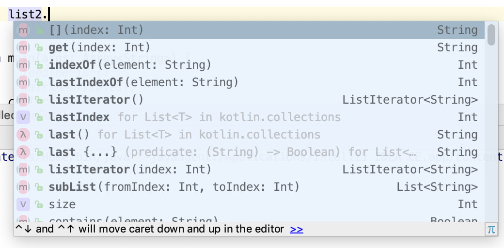

### Learn about pairs and triples

In this task, you learn about pairs and triples and destructuring them. Pairs and triples are premade data classes for 2 or 3 generic items. This can, for example, be useful for having a function return more than one value.

Suppose you had a `List` of fish, and a function `isFreshWater()` to check if the fish was a freshwater or saltwater fish. `List.partition()` returns two lists, one with the items where the condition is `true`, and the other for items where the condition is `false`.

```kotlin
val twoLists = fish.partition { isFreshWater(it) }
println("freshwater: ${twoLists.first}")
println("saltwater: ${twoLists.second}")
```

##### Make some pairs and triples
1. Open the REPL (**Tools** > **Kotlin** > **Kotlin REPL**).

2. Create a pair, associating a piece of equipment with what it is used for, then print the values. You can create a pair by creating an expression connecting two values, such as two strings, with the keyword `to`, then using `.first` or `.second` to refer to each value.

   ```kotlin
   val equipment = "fish net" to "catching fish"
   println("${equipment.first} used for ${equipment.second}")
   ```

   ```
   ⇒ fish net used for catching fish
   ```

3. Create a triple and print it with `toString()`, then convert it to a list with `toList()`. You create a triple using `Triple()` with 3 values. Use `.first`, `.second` and `.third` to refer to each value.

   ```kotlin
   val numbers = Triple(6, 9, 42)
   println(numbers.toString())
   println(numbers.toList())
   ```

   ```text
   ⇒ (6, 9, 42)
   [6, 9, 42]
   ```

The above examples use the same type for all the parts of the pair or triple, but that is not required. The parts could be a string, a number, or a list, for example—even another pair or triple.

4. Create a pair where the first part of the pair is itself a pair.

   ```kotlin
   val equipment2 = ("fish net" to "catching fish") to "equipment"
   println("${equipment2.first} is ${equipment2.second}\n")
   println("${equipment2.first.second}")
   ```

   ```
   ⇒ (fish net, catching fish) is equipment
   ⇒ catching fish
   ```

##### Destructure some pairs and triples

Separating pairs and triples into their parts is called *destructuring*. Assign the pair or triple to the appropriate number of variables, and Kotlin will assign the value of each part in order.

1. Destructure a pair and print the values.

   ```kotlin
   val equipment = "fish net" to "catching fish"
   val (tool, use) = equipment
   println("$tool is used for $use")
   ```

   ```
   ⇒ fish net is used for catching fish
   ```

2. Destructure a triple and print the values.

   ```kotlin
   val numbers = Triple(6, 9, 42)
   val (n1, n2, n3) = numbers
   println("$n1 $n2 $n3")
   ```

   ```
   ⇒ 6 9 42
   ```

Note that destructuring pairs and triples works the same as with data classes, which was covered in a previous codelab.

### Comprehend collections

In this task you learn more about collections, including lists, and a new collection type, hash maps.

##### Learn more about lists

1. Lists and mutable lists were introduced in an earlier lesson. They're a very useful data structure, so Kotlin provides a number of built-in functions for lists. Review this partial list of functions for lists. You can find complete listings in the Kotlin documentation for [`List`](https://kotlinlang.org/api/latest/jvm/stdlib/kotlin.collections/-list/index.html) and [`MutableList`](https://kotlinlang.org/api/latest/jvm/stdlib/kotlin.collections/-mutable-list/index.html).

| **Function**                            | **Purpose**                                                                             |
| --------------------------------------- | --------------------------------------------------------------------------------------- |
| `add(element: E)`                       | Add an item to the mutable list.                                                        |
| `remove(element: E)`                    | Remove an item from a mutable list.                                                     |
| `reversed()`                            | Return a copy of the list with the elements in reverse order.                           |
| `contains(element: E)`                  | Return `true` if the list contains the item.                                            |
| `subList(fromIndex: Int, toIndex: Int)` | Return part of the list, from the first index up to but not including the second index. |

2. Still working in the REPL, create a list of numbers and call `sum()` on it. This sums up all the elements.

```kotlin
val list = listOf(1, 5, 3, 4)
println(list.sum())
```

```
⇒ 13
```

3. Create a list of strings and sum the list.

```kotlin
val list2 = listOf("a", "bbb", "cc")
println(list2.sum())
```

```
⇒ error: none of the following functions can be called with the arguments supplied:
```

4. If the element isn't something `List` knows how to sum directly, such as a string, you can specify how to sum it using `.sumBy()` with a lambda function, for example, to sum by the length of each string. The default name for a lambda argument is `it` and here `it` refers to each element of the list as the list is traversed.

```kotlin
val list2 = listOf("a", "bbb", "cc")
println(list2.sumBy { it.length })
```

```
⇒ 6
```

5. There's a lot more you can do with lists. One way to see the functionality available is to create a list in IntelliJ IDEA, add the dot, and then look at the auto-completion list in the tooltip. This works for any object. Try it out with a list.



> **Note:** To see the functionality for a class, create an object in IntelliJ IDEA, add a dot after the name, and then look at the auto-completion list in the tooltip. This works for any object.

6. Choose `listIterator()` from the list, then go through the list with a `for` statement and print all the elements separated by spaces.

```kotlin
val list2 = listOf("a", "bbb", "cc")
for (s in list2.listIterator()) {
    println("$s ")
}
```

```
⇒ a bbb cc
```

##### Try out hash maps

In Kotlin, you can map pretty much anything to anything else using `hashMapOf()`. Hash maps are sort of like a list of pairs, where the first value acts as a key.

1. Create a hash map that matches symptoms, the keys, and diseases of fish, the values.

```kotlin
val cures = hashMapOf("white spots" to "Ich", "red sores" to "hole disease")
```

2. You can then retrieve the disease value based on the symptom key, using `get()`, or even shorter, square brackets `[]`.

```kotlin
println(cures.get("white spots"))
```

```
⇒ Ich
```

```kotlin
println(cures["red sores"])
```

```
⇒ hole disease
```

3. Try specifying a symptom that isn't in the map.

```kotlin
println(cures["scale loss"])
```

```
⇒ null
```

If a key isn't in the map, trying to return the matching disease returns `null`. Depending on the map data, it may be common to have no match for a possible key. For cases like that, Kotlin provides the `getOrDefault()` function.

4. Try looking up a key that has no match, using `getOrDefault()`.

```kotlin
println(cures.getOrDefault("bloating", "sorry, I don't know"))
```

```
⇒ sorry, I don't know
```

5. Change your code to use `getOrElse()` instead of `getOrDefault()`.

```kotlin
println(cures.getOrElse("bloating") {"No cure for this"})
```

```
⇒ No cure for this
```

Instead of returning a simple default value, whatever code is between the curly braces `{}` is executed. In the example, `else` simply returns a string, but it could be as fancy as finding a webpage with a cure and returning it.

Just like `mutableListOf`, you can also make a `mutableMapOf`. A mutable map lets you put and remove items. Mutable just means able to change, immutable means unable to change.

6. Make an inventory map that can be modified, mapping an equipment string to the number of items. Create it with a fish net in it, then add 3 tank scrubbers into the inventory with `put()`, and remove the fish net with `remove()`.

```kotlin
val inventory = mutableMapOf("fish net" to 1)
inventory.put("tank scrubber", 3)
println(inventory.toString())
inventory.remove("fish net")
println(inventory.toString())
```

```
⇒ {fish net=1, tank scrubber=3}{tank scrubber=3}
```

>  **Note:** Immutable collections are particularly useful in a threaded environment where there might be problems if multiple threads touch the same collection.

### Study constants

In this task, you learn about constants in Kotlin and different ways of organizing them.

##### Learn about const vs. val

In the REPL, try creating a numeric constant. In Kotlin, you can make top-level constants and assign them a value at compile time using `const val`.

```kotlin
const val rocks = 3
```

The value is assigned, and can't be changed, which sounds a lot like declaring a regular `val`. So what's the difference between `const val` and `val`? The value for `const val` is determined at compile time, where as the value for `val` is determined during program execution, which means, `val` can be assigned by a function at run time.

That means `val` can be assigned a value from a function, but `const val` cannot.

```kotlin
val value1 = complexFunctionCall() // OK
const val CONSTANT1 = complexFunctionCall() // NOT ok
```

In addition, `const val` only works at the top level, and in singleton classes declared with `object`, not with regular classes. You can use this to create a file or singleton object that contains only constants, and import them as needed.

```kotlin
object Constants {
    const val CONSTANT2 = "object constant"
}
val foo = Constants.CONSTANT2
```

##### Create a companion object

Kotlin does not have a concept of class level constants.

To define constants inside a class, you have to wrap them into companion objects declared with the `companion` keyword. The companion object is basically a singleton object within the class.

1. Create a class with a companion object containing a string constant.

```kotlin
class MyClass {
    companion object {
        const val CONSTANT3 = "constant in companion"
    }
}
```

The basic difference between companion objects and regular objects is:

- Companion objects are initialized from the static constructor of the containing class, that is, they are created when the object is created.
- Regular objects are initialized lazily on the first access to that object; that is, when they are first used.

There is more, but all that you need to know for now is to wrap constants in classes in a companion object.

### Write extensions

In this task, you learn about extending the behavior of classes. It's very common to write utility functions to extend the behavior of a class. Kotlin provides a convenient syntax for declaring these utility functions: extension functions.

Extension functions allow you to add functions to an existing class without having to access its source code. For example, you could declare them in an **Extensions.kt** file that is part of your package. This doesn't actually modify the class, but it allows you to use the dot-notation when calling the function on objects of that class.

##### Write an extension function

1. Still working in the REPL, write a simple extension function, `hasSpaces()` to check if a string contains spaces. The function name is prefixed with the class it operates on. Inside the function, `this` refers to the object it is called on, and `it` refers to the iterator in the `find()` call.

```kotlin
fun String.hasSpaces(): Boolean {
    val found = this.find { it == ' ' }
    return found != null
}
println("Does it have spaces?".hasSpaces())
```

```
⇒ true
```

2. You can simplify the `hasSpaces()` function. The `this` isn't explicitly needed, and the function can be reduced to a single expression and returned, so the curly braces `{}` around it aren't needed, either.

```kotlin
fun String.hasSpaces() = find { it == ' ' } != null
```

##### Learn the limitations of extensions

Extension functions only have access to the public API of the class they're extending. Variables that are `private` can't be accessed.

1. Try adding extension functions to a property marked `private`.

```kotlin
class AquariumPlant(val color: String, private val size: Int)

fun AquariumPlant.isRed() = color == "red"    // OK
fun AquariumPlant.isBig() = size > 50         // gives error
```

```
⇒ error: cannot access 'size': it is private in 'AquariumPlant'
```

> **Note:** Extension functions are resolved statically, at compile time, based on the type of the variable.

2. Examine the code below and figure out what it will print.

```kotlin
open class AquariumPlant(val color: String, private val size: Int)

class GreenLeafyPlant(size: Int) : AquariumPlant("green", size)

fun AquariumPlant.print() = println("AquariumPlant")
fun GreenLeafyPlant.print() = println("GreenLeafyPlant")

val plant = GreenLeafyPlant(size = 10)
plant.print()
println("\n")
val aquariumPlant: AquariumPlant = plant
aquariumPlant.print()  // what will it print?
```

```
⇒ GreenLeafyPlant
AquariumPlant
```

`plant.print()` prints `GreenLeafyPlant`. You might expect `aquariumPlant.print()` to print `GreenLeafyPlant`, too, because it was assigned the value of `plant`. But the type is resolved at compile time, so `AquariumPlant` gets printed.

##### Add an extension property

In addition to extension functions, Kotlin also lets you add extension properties. Like extension functions, you specify the class you're extending, followed by a dot, followed by the property name.

1. Still working in the REPL, add an extension property `isGreen` to `AquariumPlant`, which is `true` if the color is green.

```kotlin
val AquariumPlant.isGreen: Boolean
   get() = color == "green"
```

The `isGreen` property can be accessed just like a regular property; when accessed, the getter for `isGreen` is called to get the value.

2. Print the `isGreen` property for the `aquariumPlant` variable and observe the result.

```kotlin
aquariumPlant.isGreen
```

```
⇒ res4: kotlin.Boolean = true
```

##### Know about nullable receivers

The class you extend is called the *receiver*, and it is possible to make that class nullable. If you do that, the `this` variable used in the body can be `null`, so make sure you test for that. You would want to take a nullable receiver if you expect that callers will want to call your extension method on nullable variables, or if you want to provide a default behavior when your function is applied to `null`.

1. Still working in the REPL, define a `pull()` method that takes a nullable receiver. This is indicated with a question mark `?` after the type, before the dot. Inside the body, you can test if `this` is not `null` by using questionmark-dot-apply `?.apply.`

```kotlin
fun AquariumPlant?.pull() {
   this?.apply {
       println("removing $this")
   }
}

val plant: AquariumPlant? = null
plant.pull()
```

2. In this case, there is no output when you run the program. Because `plant` is `null`, the inner `println()` is not called.

Extension functions are very powerful, and most of the Kotlin standard library is implemented as extension functions.

### Summary

In this lesson, you learned more about collections, learned about constants, and got a taste of the power of extension functions and properties.

- Pairs and triples can be used to return more than one value from a function. For example:
  `val twoLists = fish.partition { isFreshWater(it) }`
- Kotlin has many useful functions for `List`, such as `reversed()`, `contains()`, and `subList()`.
- A `HashMap` can be used to map keys to values. For example:
  `val cures = hashMapOf("white spots" to "Ich", "red sores" to "hole disease")`
- Declare compile-time constants using the `const` keyword. You can put them at the top level, organize them in a singleton object, or put them in a companion object.
- A companion object is a singleton object within a class definition, defined with the `companion` keyword.
- Extension functions and properties can add functionality to a class. For example:
  `fun String.hasSpaces() = find { it == ' ' } != null`
- A nullable receiver allows you to create extensions on a class which can be `null`. The `?.` operator can be paired with `apply` to check for `null` before executing code. For example:
  `this?.apply { println("removing $this") }`