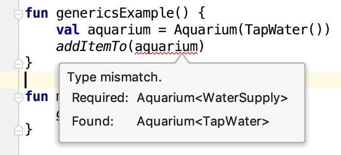
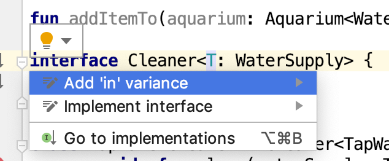

### Explore generic classes

##### Introduction to generics

Kotlin, like many programming languages, has generic types. A generic type allows you to make a class generic, and thereby make a class much more flexible.

Imagine you were implementing a `MyList` class that holds a list of items. Without generics, you would need to implement a new version of `MyList` for each type: one for `Double`, one for `String`, one for `Fish`. With generics, you can make the list generic, so it can hold any type of object. It's like making the type a wildcard that will fit many types.

To define a generic type, put T in angle brackets `<T>` after the class name. (You could use another letter or a longer name, but the convention for a generic type is T.)

```kotlin
class MyList<T> {
    fun get(pos: Int): T {
        TODO("implement")
    }
    fun addItem(item: T) {}
}
```

You can reference `T` as if it were a normal type. The return type for `get()` is `T`, and the parameter to `addItem()` is of type `T`. Of course, generic lists are very useful, so the `List` class is built into Kotlin.

##### Make a type hierarchy

In this step you create some classes to use in the next step. Subclassing was covered in an earlier codelab, but here is a brief review.

1. To keep the example uncluttered, create a new package under **src** and call it `generics`.
2. In the **generics** package, create a new `Aquarium.kt` file. This allows you to redefine things using the same names without conflicts, so the rest of your code for this codelab goes into this file.
3. Make a type hierarchy of water supply types. Start by making `WaterSupply` an `open` class, so it can be subclassed.
4. Add a boolean `var` parameter, `needsProcessing`. This automatically creates a mutable property, along with a getter and setter.
5. Make a subclass `TapWater` that extends `WaterSupply`, and pass `true` for `needsProcessing`, because the tap water contains additives which are bad for fish.
6. In `TapWater`, define a function called `addChemicalCleaners()` that sets `needsProcessing` to `false` after cleaning the water. The `needsProcessing` property can be set from `TapWater`, because it is `public` by default and accessible to subclasses. Here is the completed code.

```kotlin
package generics

open class WaterSupply(var needsProcessing: Boolean)

class TapWater : WaterSupply(true) {
   fun addChemicalCleaners() {
       needsProcessing = false
   }
}
```

1. Create two more subclasses of `WaterSupply`, called `FishStoreWater` and `LakeWater`. `FishStoreWater` doesn't need processing, but `LakeWater` must be filtered with the `filter()` method. After filtering, it does not need to be processed again, so in `filter()`, set `needsProcessing = false`.

```kotlin
class FishStoreWater : WaterSupply(false)

class LakeWater : WaterSupply(true) {
   fun filter() {
       needsProcessing = false
   }
}
```

If you need additional information, review the earlier lesson on inheritance in Kotlin.

> **Tip:** Files don't have to have the same name as their class, and you can have multiple classes in a file.

##### Make a generic class

In this step you modify the `Aquarium` class to support different types of water supplies.

1. In **Aquarium.kt**, define an `Aquarium` class, with `<T>` in brackets after the class name.
2. Add an immutable property `waterSupply` of type `T` to `Aquarium`.

```kotlin
class Aquarium<T>(val waterSupply: T)
```

3. Write a function called `genericsExample()`. This isn't part of a class, so it can go at the top level of the file, like the `main()` function or the class definitions. In the function, make an `Aquarium` and pass it a `WaterSupply`. Since the `waterSupply` parameter is generic, you must specify the type in angle brackets `<>`.

```kotlin
fun genericsExample() {
    val aquarium = Aquarium<TapWater>(TapWater())
}
```

4. In `genericsExample()` your code can access the aquarium's `waterSupply`. Because it is of type `TapWater`, you can call `addChemicalCleaners()` without any type casts.

```kotlin
fun genericsExample() {
    val aquarium = Aquarium<TapWater>(TapWater())
    aquarium.waterSupply.addChemicalCleaners()
}
```

5. When creating the `Aquarium` object, you can remove the angle brackets and what's between them because Kotlin has type inference. So there's no reason to say `TapWater` twice when you create the instance. The type can be inferred by the argument to `Aquarium`; it will still make an `Aquarium` of type `TapWater`.

```kotlin
fun genericsExample() {
    val aquarium = Aquarium(TapWater())
    aquarium.waterSupply.addChemicalCleaners()
}
```

6. To see what is happening, print `needsProcessing` before and after calling `addChemicalCleaners()`. Below is the completed function.

```kotlin
fun genericsExample() {
    val aquarium = Aquarium<TapWater>(TapWater())
    println("water needs processing: ${aquarium.waterSupply.needsProcessing}")
    aquarium.waterSupply.addChemicalCleaners()
    println("water needs processing: ${aquarium.waterSupply.needsProcessing}")
}
```

7. Add a `main()` function to call `genericsExample()`, then run your program and observe the result.

```kotlin
fun main() {
    genericsExample()
}
```

```
⇒ water needs processing: true
water needs processing: false
```

##### Make it more specific

Generic means you can pass almost anything, and sometimes that's a problem. In this step you make the `Aquarium` class more specific about what you can put in it.

1. In `genericsExample()`, create an `Aquarium`, passing a string for the `waterSupply`, then print the aquarium's `waterSupply` property.

```kotlin
fun genericsExample() {
    val aquarium2 = Aquarium("string")
    println(aquarium2.waterSupply)
}
```
2. Run your program observe the result.

```
⇒ string
```

The result is the string you passed, because `Aquarium` doesn't put any limitations on `T.`Any type, including `String`, can be passed in.

3. In `genericsExample()`, create another `Aquarium`, passing `null` for the `waterSupply`. If the `waterSupply` is null, print `"waterSupply is null"`.

```kotlin
fun genericsExample() {
    val aquarium3 = Aquarium(null)
    if (aquarium3.waterSupply == null) {
        println("waterSupply is null")
    }
}
```

4. Run your program and observe the result.

```
⇒ waterSupply is null
```

Why can you pass `null` when creating an `Aquarium`? This is possible because by default, `T` stands for the nullable `Any?` type, the type at the top of the type hierarchy. The following is equivalent to what you typed earlier.

```kotlin
class Aquarium<T: Any?>(val waterSupply: T)
```

5. To not allow passing `null`, make `T` of type `Any` explicitly, by removing the `?` after `Any`.

```kotlin
class Aquarium<T: Any>(val waterSupply: T)
```

In this context, `Any` is called a [*generic constraint*](https://kotlinlang.org/docs/reference/generics.html#generic-constraints). It means any type can be passed for `T` as long as it isn't `null`.

6. What you really want is to make sure that only a `WaterSupply` (or one of its subclasses) can be passed for `T`. Replace `Any` with `WaterSupply` to define a more specific generic constraint.

```kotlin
class Aquarium<T: WaterSupply>(val waterSupply: T)
```

##### Add more checking

In this step you learn about the [`check()`](https://kotlinlang.org/api/latest/jvm/stdlib/kotlin/check.html) function to help ensure your code is behaving as expected. The `check()`function is a standard library function in Kotlin. It acts as an assertion and will throw an `IllegalStateException` if its argument evaluates to `false`.

1. Add an `addWater()` method to `Aquarium` class to add water, with a `check()` that makes sure you don't need to process the water first.

```kotlin
class Aquarium<T: WaterSupply>(val waterSupply: T) {
    fun addWater() {
        check(!waterSupply.needsProcessing) { "water supply needs processing first" }
        println("adding water from $waterSupply")
    }    
}
```

In this case, if `needsProcessing` is true, `check()` will throw an exception.

2. In `genericsExample()`, add code to make an `Aquarium` with `LakeWater`, and then add some water to it.

```kotlin
fun genericsExample() {
    val aquarium4 = Aquarium(LakeWater())
    aquarium4.addWater()
}
```

3. Run your program, and you will get an exception, because the water needs to be filtered first.

```
⇒ Exception in thread "main" java.lang.IllegalStateException: water supply needs processing first
        at Aquarium.generics.Aquarium.addWater(Aquarium.kt:21)
```

4. Add a call to filter the water before adding it to the `Aquarium`. Now when you run your program, there is no exception thrown.

```kotlin
fun genericsExample() {
    val aquarium4 = Aquarium(LakeWater())
    aquarium4.waterSupply.filter()
    aquarium4.addWater()
}
```

```
⇒ adding water from generics.LakeWater@880ec60
```

> **Tip:** Use the `check()` function to help ensure that your code is working as expected.

The above covers the basics of generics. The following tasks cover more, but the important concept is how to declare and use a generic class with a generic constraint.

### Learn about in and out types

In this task, you learn about [in and out types](https://kotlinlang.org/docs/reference/generics.html#declaration-site-variance) with generics. An `in` type is a type that can only be passed into a class, not returned. An `out` type is a type that can only be returned from a class.

Look at the `Aquarium` class and you'll see that the generic type is only ever returned when getting the property `waterSupply`. There aren't any methods that take a value of type `T` as a parameter (except for defining it in the constructor). Kotlin lets you define `out` types for exactly this case, and it can infer extra information about where the types are safe to use. Similarly, you can define `in` types for generic types that are only ever passed into methods, not returned. This allows Kotlin to do extra checks for code safety.

The `in` and `out` types are directives for Kotlin's type system. Explaining the whole type system is outside the scope of this bootcamp (it's pretty involved); however, the compiler will flag types that are not marked `in` and `out` appropriately, so you need to know about them.

> **Note:**
>
> `val` and `var` are about the VALUES of variables. `val` protects the variable value from being changed.
>
> `in` and `out` are about the TYPES of variables. `in` and `out` make sure that when working with generic types, only safe types are passed in and out of functions.

##### Define an out type

1. In the `Aquarium` class, change `T: WaterSupply` to be an `out` type.

```kotlin
class Aquarium<out T: WaterSupply>(val waterSupply: T) {
    ...
}
```

2. In the same file, outside the class, declare a function `addItemTo()` that expects an `Aquarium` of `WaterSupply`.

```kotlin
fun addItemTo(aquarium: Aquarium<WaterSupply>) = println("item added")
```

3. Call `addItemTo()` from `genericsExample()` and run your program.

```kotlin
fun genericsExample() {
    val aquarium = Aquarium(TapWater())
    addItemTo(aquarium)
}
```

```
⇒ item added
```

Kotlin can ensure that `addItemTo()` won't do anything type unsafe with the generic `WaterSupply`, because it's declared as an `out` type.

4. If you remove the `out` keyword, the compiler will give an error when calling `addItemTo()`, because Kotlin can't ensure that you are not doing anything unsafe with the type.



##### Define an in type

The `in` type is similar to the `out` type, but for generic types that are only ever passed into functions, not returned. If you try to return an `in` type, you'll get a compiler error. In this example you'll define an `in` type as part of an interface.

1. In **Aquarium.kt**, define an interface `Cleaner` that takes a generic `T` that's constrained to `WaterSupply`. Since it is only used as an argument to `clean()`, you can make it an `in` parameter.

```kotlin
interface Cleaner<in T: WaterSupply> {
    fun clean(waterSupply: T)
}
```

2. To use the `Cleaner` interface, create a class `TapWaterCleaner` that implements `Cleaner` for cleaning `TapWater` by adding chemicals.

```kotlin
class TapWaterCleaner : Cleaner<TapWater> {
    override fun clean(waterSupply: TapWater) =   waterSupply.addChemicalCleaners()
}
```

3. In the `Aquarium` class, update `addWater()` to take a `Cleaner` of type `T`, and clean the water before adding it.

```kotlin
class Aquarium<out T: WaterSupply>(val waterSupply: T) {
    fun addWater(cleaner: Cleaner<T>) {
        if (waterSupply.needsProcessing) {
            cleaner.clean(waterSupply)
        }
        println("water added")
    }
}
```

4. Update the `genericsExample()` example code to make a `TapWaterCleaner`, an `Aquarium` with `TapWater`, and then add some water using the cleaner. It will use the cleaner as needed.

```kotlin
fun genericsExample() {
    val cleaner = TapWaterCleaner()
    val aquarium = Aquarium(TapWater())
    aquarium.addWater(cleaner)
}
```

Kotlin will use the the `in` and `out` type information to make sure your code uses the generics safely. `Out` and `in` are easy to remember: `out` types can be passed outward as return values, `in` types can be passed inward as arguments.

> **Tip:** The IntelliJ IDEA will suggest you add `out` or `in` to your generic types when it's correct to do so. If you click on the generic type name, IntelliJ IDEA will put an "intention bulb" at the start of the line. If you click on the bulb, a list of suggestions will appear.



If you want to dig in more to [the sort of problems in types and out types solve](https://kotlinlang.org/docs/reference/generics.html), the documentation covers them in depth.